# ZoneAudit™ Community Edition

> **Languages:** [English](translations/README.en.md) | [Français](translations/README.fr.md) | [Deutsch](translations/README.de.md)

**Fast, read-only discovery of a domain's public footprint: subdomains, DNS, certificates, domain expiry and email security.**

ZoneAudit™ Community Edition is built for rapid mapping of high-value subdomains and active DNS validation. It handles the heavy lifting of network probing by discovering critical entry points, validating active DNS resolution, and running targeted heuristics to spot risks like dangling CNAMEs and orphaned infrastructure before attackers do.

---

## Architecture: From Raw Telemetry to Operational Clarity

```mermaid
architecture-beta
    group user(logos:go)[ZoneAudit CLI]

    service rdap(logos:internet-computer)[RDAP Expiry] in user
    service dns(logos:google-cloud-dns)[DNS Probing] in user
    service http(logos:apache-http-server)[HTTP Banners] in user
    service ssl(logos:lets-encrypt)[SSL Validation] in user

    junction pipeline

    rdap:B -- T:pipeline
    dns:B -- T:pipeline
    http:B -- T:pipeline
    ssl:B -- T:pipeline

    group engine(logos:google-cloud-functions)[ZoneAudit AI Engine]
    service report(logos:googledrive-sheets)[Intelligent Insight] in engine

    pipeline:B --> T:report{group}
```



This utility is designed to function as a standalone worker for the ZoneAudit data pipeline.

1. **The Community Edition (This repo):** Runs concurrent lookups and provides raw findings (DNS, SSL, RDAP, HTTP) in text or JSON format.
2. **The ZoneAudit Platform:** Processes telemetry through an asynchronous AI engine to generate **DeepScan Intelligent Insight™** reports that a director can read and act on in a few minutes.

---

## Responsible use

Only scan domains you own or are authorised to assess. ZoneAudit Community Edition resolves DNS records and makes one light HTTP(S) request and TLS handshake to each host it discovers; it does not scan ports or attempt access.

## Getting Started

### Capabilities (v0.2.0)

- **Domain Intelligence**: RDAP-driven domain expiration alerts.
- **Subdomain Discovery**: 143 common infrastructure hostnames checked.
- **Service Fingerprinting**: HTTP banner and page title extraction.
- **Security Validation**: SSL/TLS certificate expiry and issuer verification.
- **Multilingual**: Full output support for English, French, and German.

Check the [CHANGELOG.md](CHANGELOG.md) for the full list of changes.

### Supported Languages

The CLI supports the following languages. Note that translations are provided as a convenience and may vary in technical nuance.

| Language | Code | Activation | Documentation |
| :--- | :--- | :--- | :--- |
| English | `en` | Default | [README.en.md](translations/README.en.md) |
| Français | `fr` | `-lang fr` or `LANG=fr` | [README.fr.md](translations/README.fr.md) |
| Deutsch | `de` | `-lang de` or `LANG=de` | [README.de.md](translations/README.de.md) |

#### Setting Language Environment Variable

You can set the `LANG` environment variable in your terminal session to change the output language. On Linux or macOS:

```bash
LANG=fr zoneaudit -d example.com
```

Alternatively, you can use the built-in flag:

```bash
zoneaudit -d example.com -lang fr
```

Ensure you have [Go](https://go.dev/dl/) installed on your system.

```bash
go install github.com/ZoneAudit/zoneaudit-cli/cmd/zoneaudit@latest
```

### Usage

Scan any domain to reveal active subdomains and DNS exposure:

```bash
zoneaudit -d example.com
```

Output as JSON for pipeline integration:

```bash
zoneaudit -d example.com -json
```

---

## Roadmap and Community Future

**ZoneAudit™ Community Edition** is the lightweight, open-source entry point to our ecosystem. While the current focus is on subdomain, DNS and TLS findings, we are evaluating the following capabilities for future releases:

- **Enhanced Protocol Probing**: Native SMTP, FTP, and SSH handshake heuristics to identify exposed legacy services.
- **Header Analysis**: Passive inspection of security headers (HSTS, CSP, X-Frame-Options) during HTTP(S) validation.
- **Local Persistence**: Support for local SQLite storage to track historical changes to an attack surface over time.

We welcome feedback on which features would best support your security workflows.

---

## From findings to a readiness review

This CLI collects the raw findings. A ZoneAudit readiness review turns them into a prioritised report with fixes, including DCC Level 0 readiness for suppliers to the Ministry of Defence.

[Arrange a ZoneAudit readiness review](https://zoneaudit.com?utm_source=github&utm_medium=readme&utm_campaign=community_edition)

---

## Community and Governance

### Reporting Bugs and Asking Questions

If you have an idea, find a bug, or just have a question about the tool, please [open a GitHub Issue](https://github.com/ZoneAudit/zoneaudit-cli/issues). We will do our best to help.

### Contributing

We are happy to see community contributions. If you want to help:

1. Fork the repo.
2. Create your branch (`git checkout -b feature/your-feature`).
3. Commit your changes.
4. Open a pull request.

Keep an eye on existing style and ensure any new logic is tested.

### License

This project is licensed under the **MIT License**. See the [LICENSE](LICENSE) file for the full text.

### 🇬🇧 Engineering Precision from the UK by [CobraSphere](https://cobrasphere.com?utm_source=github&utm_medium=readme&utm_campaign=community_edition)
