# ZoneAudit™ Community Edition

> **Sprachen:** [English](README.en.md) | [Français](README.fr.md) | [Deutsch](README.de.md)

**Taktische Entdeckung digitaler Kernperimeter mit Hochgeschwindigkeits-Go-Telemetrie.**

Die ZoneAudit™ Community Edition ist für die schnelle Kartierung hochwertiger Subdomains und die aktive DNS-Validierung konzipiert. Sie übernimmt die schwere Arbeit des Netzwerk-Probing, indem sie kritische Einstiegspunkte entdeckt, die aktive DNS-Auflösung validiert und gezielte Heuristiken ausführt, um Risiken wie hängende CNAMEs und verwaiste Infrastrukturen zu erkennen, bevor Angreifer es tun.

---

## Architektur: Von roher Telemetrie zu operativer Klarheit

```mermaid
architecture-beta
    group user(logos:go)[ZoneAudit CLI]

    service rdap(logos:internet-computer)[RDAP Ablauf] in user
    service dns(logos:google-cloud-dns)[DNS Probing] in user
    service http(logos:apache-http-server)[HTTP Banner] in user
    service ssl(logos:lets-encrypt)[SSL Validierung] in user

    junction pipeline

    rdap:B -- T:pipeline
    dns:B -- T:pipeline
    http:B -- T:pipeline
    ssl:B -- T:pipeline

    group engine(logos:google-cloud-functions)[ZoneAudit KI Engine]
    service report(logos:googledrive-sheets)[Intelligente Einblicke] in engine

    pipeline:B --> T:report{group}
```



Dieses Utility ist als eigenständiger Worker für die ZoneAudit-Datenpipeline konzipiert.

1. **Die Community Edition (Dieses Repo):** Führt Hochgeschwindigkeits-Scans durch und liefert rohe Telemetrie (DNS, SSL, RDAP, HTTP) im Text- oder JSON-Format.
2. **Die ZoneAudit-Plattform:** Verarbeitet Telemetrie durch eine asynchrone KI-Engine, um **DeepScan Intelligent Insight™** Berichte zu erstellen, die den „3-Uhr-Morgens-Test“ für Führungskräfte in 3 Sekunden bestehen.

---

## Erste Schritte

### Funktionen (v0.2.0)

- **Domain Intelligence**: RDAP-gesteuerte Warnungen zum Domainablauf.
- **Taktische Entdeckung**: Über 140 hochwertige Subdomains, gezielt für Infrastruktur-Hotspots.
- **Service-Fingerprinting**: Extraktion von HTTP-Bannern und Seitentiteln.
- **Sicherheitsvalidierung**: Überprüfung von SSL/TLS-Zertifikatsablauf und Aussteller.
- **Mehrsprachig**: Volle Unterstützung der Ausgabe für Englisch, Französisch und Deutsch.

Weitere Details finden Sie im [CHANGELOG.de.md](CHANGELOG.de.md).

### Unterstützte Sprachen

Das CLI unterstützt die folgenden Sprachen. Beachten Sie, dass Übersetzungen als Annehmlichkeit bereitgestellt werden und in der technischen Nuance variieren können.

| Sprache | Code | Aktivierung | Dokumentation |
| :--- | :--- | :--- | :--- |
| Englisch | `en` | Standard | [README.en.md](README.en.md) |
| Französisch | `fr` | `-lang fr` oder `LANG=fr` | [README.fr.md](README.fr.md) |
| Deutsch | `de` | `-lang de` oder `LANG=de` | [README.de.md](README.de.md) |

#### Einstellen der Sprache-Umgebungsvariable

Sie können die Umgebungsvariable `LANG` in Ihrer Terminalsitzung festlegen, um die Ausgabesprache zu ändern. Unter Linux oder macOS:

```bash
LANG=fr zoneaudit -d example.com
```

Alternativ können Sie das integrierte Flag verwenden:

```bash
zoneaudit -d example.com -lang fr
```

Stellen Sie sicher, dass [Go](https://go.dev/dl/) auf Ihrem System installiert ist.

```bash
go install github.com/ZoneAudit/zoneaudit-cli/cmd/zoneaudit@latest
```

### Verwendung

Scannen Sie eine beliebige Domain, um aktive Subdomains und DNS-Exponierung aufzudecken:

```bash
zoneaudit -d example.com
```

Ausgabe als JSON für die Pipeline-Integration:

```bash
zoneaudit -d example.com -json
```

---

## Roadmap und Community-Zukunft

Die **ZoneAudit™ Community Edition** ist der leichtgewichtige Open-Source-Einstiegspunkt in unser Ökosystem. Während der aktuelle Fokus auf Hochgeschwindigkeits-Subdomain- und SSL/TLS-Telemetrie liegt, evaluieren wir die folgenden Funktionen für zukünftige Versionen:

- **Erweitertes Protokoll-Probing**: Native SMTP-, FTP- und SSH-Handshake-Heuristiken zur Identifizierung exponierter Legacy-Dienste.
- **Header-Analyse**: Passive Inspektion von Security-Headern (HSTS, CSP, X-Frame-Options) während der HTTP(S)-Validierung.
- **Port-Erkennung**: Integration gezielter Port-Scans für standardmäßige Hochrisiko-Industrie- und Datenbank-Ports.
- **Lokale Persistenz**: Unterstützung für lokale SQLite-Speicherung zur Verfolgung historischer Änderungen einer Angriffsoberfläche im Laufe der Zeit.

Wir freuen uns über Feedback dazu, welche dieser oder anderer Funktionen Ihre Security-Workflows am besten unterstützen würden.

---

## Zugang zur vollständigen Enterprise-Infrastruktur

Während dieses CLI-Tool die rohe Datenerfassung übernimmt, bietet die vollständige Enterprise-Lösung automatisierte Zeitplanung, ein zentralisiertes Ingestion-Backend und KI-gesteuerte Triage-Berichte.

[Melden Sie sich auf der Warteliste von ZoneAudit.com an](https://zoneaudit.com?utm_source=github&utm_medium=readme&utm_campaign=community_edition_de) um frühen Zugang zur Plattform **ZoneAudit™** für fortschrittliche externe Attack Surface Intelligence zu erhalten.

---

## Community und Governance

### Fehler melden und Fragen stellen

Wenn Sie eine Idee haben, einen Fehler finden oder einfach nur eine Frage zum Tool haben, [öffnen Sie bitte ein GitHub-Issue](https://github.com/ZoneAudit/zoneaudit-cli/issues). Wir werden unser Bestes tun, um zu helfen.

### Beitragen

Wir freuen uns über Beiträge aus der Community. Wenn Sie helfen möchten:

1. Forken Sie das Repo.
2. Erstellen Sie Ihren Branch (`git checkout -b feature/ihr-feature`).
3. Comitten Sie Ihre Änderungen.
4. Öffnen Sie einen Pull-Request.

Achten Sie auf den bestehenden Stil und stellen Sie sicher, dass jede neue Logik getestet wird.

### Lizenz

Dieses Projekt ist unter der **MIT-Lizenz** lizenziert. Siehe die Datei [LICENSE](../LICENSE) für den vollständigen Text.

### 🇬🇧 Entwickelt im Vereinigten Königreich von [CobraSphere](https://cobrasphere.com?utm_source=github&utm_medium=readme&utm_campaign=community_edition_de)
