# ZoneAudit™ Community Edition

> **Langues :** [English](README.en.md) | [Français](README.fr.md) | [Deutsch](README.de.md)

**Découverte tactique des périmètres numériques de base avec une télémétrie Go à haute vélocité.**

La ZoneAudit™ Community Edition est conçue pour la cartographie rapide des sous-domaines de haute valeur et la validation DNS active. Elle gère le travail lourd de sondage réseau en découvrant les points d'entrée critiques, en validant la résolution DNS active et en exécutant des heuristiques ciblées pour repérer les risques tels que les CNAME pendants et les infrastructures orphelines avant que les attaquants ne le fassent.

---

## Architecture : de la télémétrie brute à la clarté opérationnelle

```mermaid
architecture-beta
    group user(logos:go)[ZoneAudit CLI]

    service rdap(logos:internet-computer)[Expiration RDAP] in user
    service dns(logos:google-cloud-dns)[Sondage DNS] in user
    service http(logos:apache-http-server)[Bannières HTTP] in user
    service ssl(logos:lets-encrypt)[Validation SSL] in user

    junction pipeline

    rdap:B -- T:pipeline
    dns:B -- T:pipeline
    http:B -- T:pipeline
    ssl:B -- T:pipeline

    group engine(logos:google-cloud-functions)[Moteur d'IA ZoneAudit]
    service report(logos:googledrive-sheets)[Aperçus Intelligents] in engine

    pipeline:B --> T:report{group}
```



Cet utilitaire est conçu pour fonctionner comme un agent indépendant pour le pipeline de données ZoneAudit.

1. **L'édition communautaire (Ce repo) :** Exécute des scans concurrents à haute vélocité et fournit de la télémétrie brute (DNS, SSL, RDAP, HTTP) au format texte ou JSON.
2. **La plateforme ZoneAudit :** Traite la télémétrie via un moteur d'IA asynchrone pour générer des rapports **DeepScan Intelligent Insight™** conçus pour passer le « test du réveil à 3h du matin » pour les dirigeants d'entreprise en moins de 3 secondes.

---

## Utilisation responsable

Analysez uniquement les domaines dont vous êtes propriétaire ou que vous êtes autorisé à évaluer. ZoneAudit Community Edition résout les enregistrements DNS et effectue une seule requête HTTP(S) légère et une négociation TLS vers chaque hôte découvert ; il ne scanne pas les ports et ne tente aucun accès.

## Mise en route

### Capacités (v0.2.0)

- **Intelligence de domaine** : Alertes d'expiration de domaine pilotées par RDAP.
- **Découverte tactique** : Plus de 140 sous-domaines de haute valeur ciblés pour les points chauds de l'infrastructure.
- **Empreinte de service** : Extraction de bannières HTTP et de titres de page.
- **Validation de sécurité** : Vérification de l'expiration des certificats SSL/TLS et de l'émetteur.
- **Multilingue** : Prise en charge complète de la sortie pour l'anglais, le français et l'allemand.

Consultez le [CHANGELOG.fr.md](CHANGELOG.fr.md) pour la liste complète des changements.

### Langues supportées

Le CLI prend en charge les langues suivantes. Notez que les traductions sont fournies à titre de commodité et peuvent varier en nuance technique.

| Langue | Code | Activation | Documentation |
| :--- | :--- | :--- | :--- |
| English | `en` | Par défaut | [README.en.md](README.en.md) |
| Français | `fr` | `-lang fr` ou `LANG=fr` | [README.fr.md](README.fr.md) |
| Deutsch | `de` | `-lang de` ou `LANG=de` | [README.de.md](README.de.md) |

#### Configuration de la variable d'environnement de langue

Vous pouvez définir la variable d'environnement `LANG` dans votre session de terminal pour changer la langue de sortie. Sur Linux ou macOS :

```bash
LANG=fr zoneaudit -d example.com
```

Alternativement, vous pouvez utiliser le drapeau intégré :

```bash
zoneaudit -d example.com -lang fr
```

Assurez-vous d'avoir [Go](https://go.dev/dl/) installé sur votre système.

```bash
go install github.com/ZoneAudit/zoneaudit-cli/cmd/zoneaudit@latest
```

### Utilisation

Scannez n'importe quel domaine pour révéler les sous-domaines actifs et l'exposition DNS :

```bash
zoneaudit -d example.com
```

Sortie au format JSON pour l'intégration de pipeline :

```bash
zoneaudit -d example.com -json
```

---

## Feuille de route et futur de la communauté

La **ZoneAudit™ Community Edition** est le point d'entrée léger et open-source de notre écosystème. Bien que l'accent actuel soit mis sur la télémétrie de sous-domaines et SSL/TLS à haute vélocité, nous évaluons les capacités suivantes pour les versions futures :

- **Sondage protocolaire amélioré** : Heuristiques natives de poignée de main SMTP, FTP et SSH pour identifier les services hérités exposés.
- **Analyse des en-têtes** : Inspection passive des en-têtes de sécurité (HSTS, CSP, X-Frame-Options) lors de la validation HTTP(S).
- **Découverte de ports** : Intégration de scans de ports ciblés pour les ports industriels et de bases de données standard à haut risque.
- **Persistance locale** : Prise en charge du stockage SQLite local pour suivre les changements historiques d'une surface d'attaque au fil du temps.

Nous apprécions vos commentaires sur les fonctionnalités qui aideraient le plus vos flux de travail de sécurité.

---

## Accéder à l'infrastructure d'entreprise complète

Alors que cet utilitaire CLI gère la collecte de données brutes, l'expérience d'entreprise complète offre une planification automatisée, un backend d'ingestion centralisé et des rapports de triage pilotés par l'IA.

[Rejoignez la liste d'attente sur ZoneAudit.com](https://zoneaudit.com?utm_source=github&utm_medium=readme&utm_campaign=community_edition_fr) pour obtenir un accès anticipé à la plateforme **ZoneAudit™** pour une intelligence avancée de la surface d'attaque externe.

---

## Communauté et gouvernance

### Signaler des bogues et poser des questions

Si vous avez une idée, trouvez un bogue ou avez simplement une question sur l'outil, veuillez [ouvrir un ticket GitHub](https://github.com/ZoneAudit/zoneaudit-cli/issues). Nous ferons de notre mieux pour vous aider.

### Contribuer

Nous sommes heureux de voir des contributions de la communauté. Si vous voulez aider :

1. Forkez le repo.
2. Créez votre branche (`git checkout -b feature/votre-feature`).
3. Validez vos changements.
4. Ouvrez une pull request.

Gardez un œil sur le style existant et assurez-vous que toute nouvelle logique est testée.

### Licence

Ce projet est sous licence **MIT**. Voir le fichier [LICENSE](../LICENSE) pour le texte complet.

### 🇬🇧 Conçu au Royaume-Uni par [CobraSphere](https://cobrasphere.com?utm_source=github&utm_medium=readme&utm_campaign=community_edition_fr)
